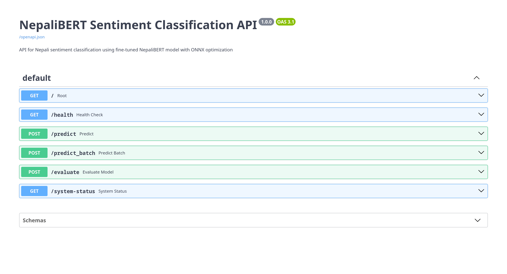
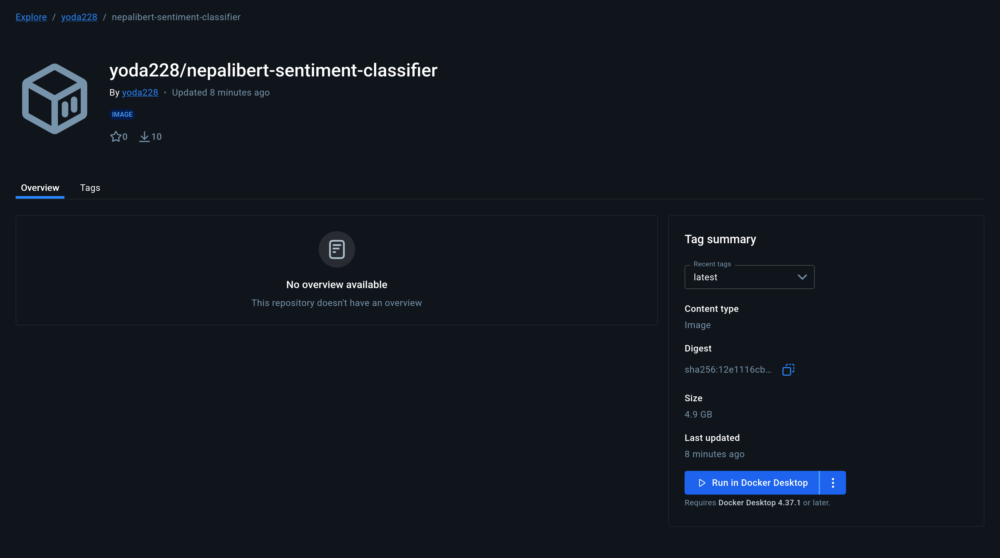

# NepaliBERT Sentiment Classification

## Inference Demo

## NepaliBERT Sentiment Classification API Endpoints



- `/predict`: performs sentiment classification on single input text
- `/predict_batch`: performs sentiment classification on multiple input texts (one per line)
- `/evaluate`: performs sentiment classification on a dataset (.csv, .json, .tsv)

- ⚠️ Notes:
  - The `/evaluate` endpoint expects `dataset_path`, so it is recommeded to use the **NepaliBERT Sentiment Classification Gradio Frontend**.
  - The dataset to be used for `/evaluate` endpoint must have `text` and `label` columns. If not present, rename the columns in the dataset.
  - Sentiment Label:
    - 0: Negative
    - 1: Neutral
    - 2: Positive

## Run with Docker

### Docker Hub

You can find the [NepaliBERT Sentiment Classifier](https://hub.docker.com/r/yoda228/nepalibert-sentiment-classifier) on Docker Hub.



### How to Run

#### On CPU:
```bash
docker run -d -p 8001:8001 -p 7860:7860 --name nepali-sentiment-classifier-app yoda228/nepalibert-sentiment-classifier:latest
```

#### On GPU:
```bash
docker run -d -p 8001:8001 -p 7860:7860 --gpus all --name nepali-sentiment-classifier-app-gpu yoda228/nepalibert-sentiment-classifier:latest
```

> Visit <http://localhost:8001/docs> or <http://127.0.0.1:8001/docs> or <http://0.0.0.0:8001/docs> to access the **NepaliBERT Sentiment Classification API** once the container finishes booting.

> Visit <http://localhost:7860> or <http://127.0.0.1:7860> or <http://0.0.0.0:7860> to access the **NepaliBERT Sentiment Classification Gradio Frontend** once the container finishes booting.
